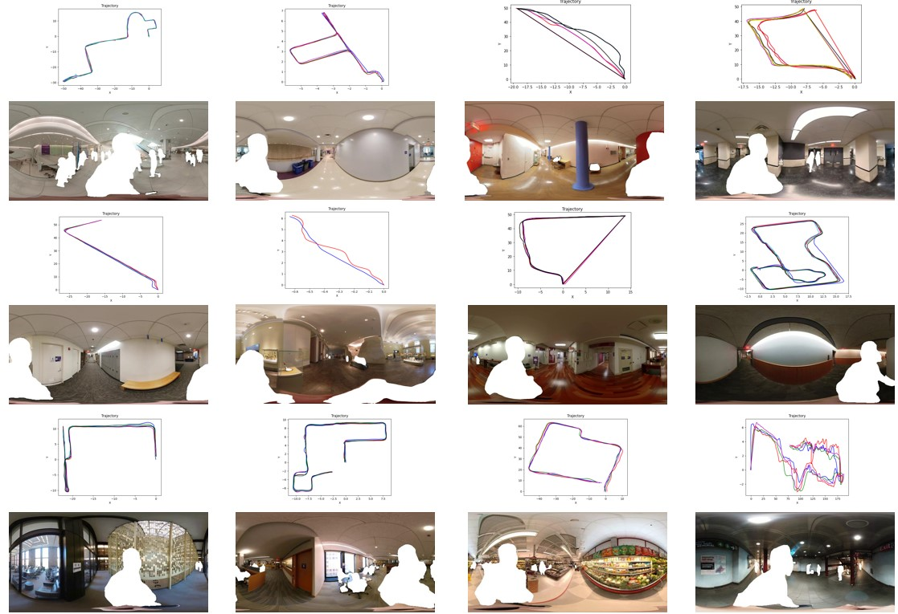
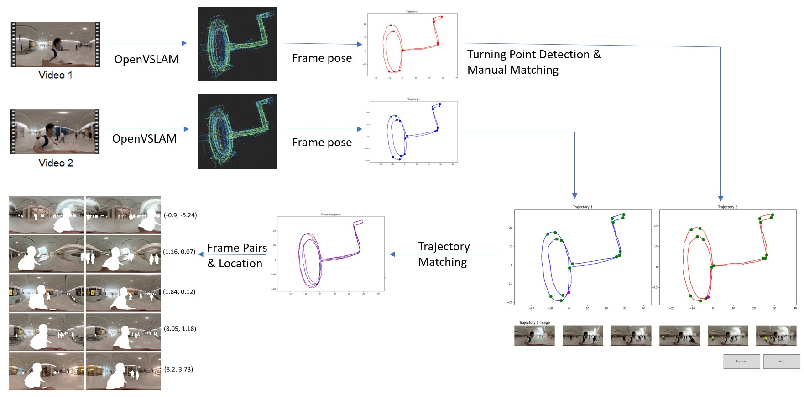

# NYC-Indoor-VPR

Diwei Sheng, Anbang Yang, John-Ross Rizzo, Chen Feng

Dataset

Semi-auto annotation method

[Paper on arXiv](https://arxiv.org/pdf/2404.00504)
## News
- [2023/06]: We release **NYC-Indoor** for academic usage.
- [2023/06]: NYC-Indoor is submitted to **NeurIPS 2023 Track on Datasets and Benchmarks**.
- [2024/03]: NYC-Indoor is accepted by **ICRA 2024**.

## Abstract
Visual Place Recognition (VPR) seeks to enhance the ability of camera systems to identify previously visited places based on captured images. This paper introduces the NYC-Indoor dataset, a rich collection of over 36,000 images compiled from 13 distinct scenes within a span of a year. NYC-Indoor is a unique, year-long indoor VPR benchmark dataset comprising images from different crowded scenes in New York City, taken under varying lighting conditions with seasonal and appearance changes. To establish ground truth for this dataset, we propose a semi-automatic annotation approach that computes the positional information of each image. Our method specifically takes pairs of videos as input and yields matched pairs of images, along with their estimated relative locations. The accuracy of this matching process is further refined by human annotators, who utilize our custom annotation interface to correlate selected keyframes. We apply our annotation methodology to the NYC-Indoor dataset. Finally, we present a benchmark evaluation of several state-of-the-art VPR algorithms using our dataset.

## NYC-Indoor Dataset
NYC-Indoor dataset is a rich collection of over 36,000 images compiled from 13 distinct scenes within a span of a year. The dataset can be downloaded from [HuggingFace](https://huggingface.co/datasets/ai4ce/NYC-Indoor-VPR-Data/tree/main). We release NYC-Indoor under [CC BY-NC-SA 4.0](https://creativecommons.org/licenses/by-nc-sa/4.0/).

## Benchmark
We benchmarked four state-of-the-art deep learning VPR methods on the NYC-Indoor dataset: CosPlace, MixVPR, ResNet+NetVLAD, and CCT+NetVLAD. For more details, please refer to the [benchmark](./benchmark) folder file.

## Semi-auto Annotation
Our semi-automatic annotation method can efficiently and accurately match trajectories and generate images with topometric locations as ground truth, applicable to any indoor VPR dataset. For more details, please refer to the [method](./method) folder file.
